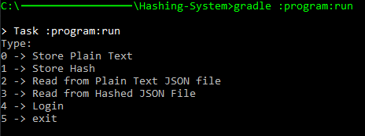

# Hashing-System
This project is a simple implementation of a password hashing algorithm written in Java. Its purpose is to show how passwords are hashed, stored, and the importance of not keeping sensitive information in plain text. The hashes and plain text are stored in JSON files for easy readability and editing purposes. This project was made for educational purposes for class 4416 - Cybersecurity and Resilience in Fall 2021.

## Installation
This program uses Gradle as its build tool and requires it to be executed properly. Gradle will need to be installed and its distributions can be found here: [Distributions.](https://services.gradle.org/distributions/)
The project is composed of one module called `program`. It handles all of the functionality of the application. Using the command 

```bash 
$ gradle :program:assemble
```

will produce the files `program/build/distributions/Hashing-System-1.0-SNAPSHOT` for `.zip` and `.tar`. This installation can be unpacked wherever you wish to run the application.

## Usage
The application can be executed in two main ways.

### 1.
If the installation step was not followed, use the following commands to run the application:

```bash 
$ gradle :program:run
```
or if gradle is not installed on your system:

```bash
$ gradlew :program:run
```
### 2.
If the installation was done correctly, the following command can be used to run the application:

```bash
$ cd <directory of appliaction>
$ ./bin/Hashing-System
```
Once the appliaction has been executed and is running, you should see something similar to this:
<br />

<br />
Entering:
- 0 Lets you store a password in plain text
- 1 Lets you store a password that becomes hashed 
- 2 Prompts the user for a key (their username) and returns that user's password in plain text if there is a match
- 3 Prompts the user for a key (their username) and returns that user's password hashed if there is a match
- 4 Prompts the user for their Username and Password. The username is matched with its key and the password is hashed. If the newly hashed password matches the stored hash with the matching key, the system outputs `System Match`
- 5 Simply exits the application


All changes to the passwords can be easily viewed under the `JsonFiles/` folder where `Hashes.json` and `PlainText.json` are stored.

## Report
A full report has been completed researching various hashing algorithms and implementing the SHA-2 algorithm itself inside the application. Other topics covered include how hashing works, its history, and the importance of securely storing information (cryptography). The report can be found [here.](docs/Report.pdf)


